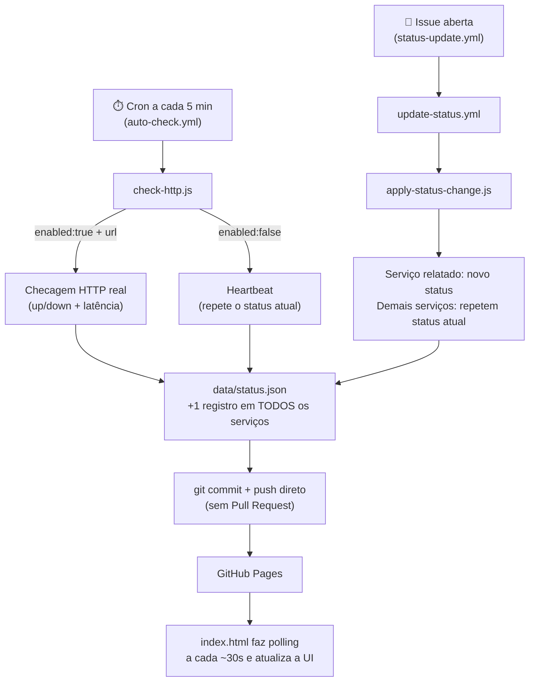

# Status dos Sistemas — Hospital

Painel público e estático de status da infraestrutura crítica do hospital
(gerador, oxigênio, rede, prontuário eletrônico, elevadores, climatização,
água). Sem login ou senha no navegador de propósito — qualquer pessoa pode
consultar. A segurança de **quem pode mudar o status** vem do próprio
GitHub: login, 2FA e permissões de colaborador (quem pode abrir uma Issue
no repositório).

O site (puro HTML/CSS/JS, sem frameworks) faz polling de `data/status.json`
a cada ~30 segundos e atualiza a interface sozinho, sem precisar de F5.

## Estrutura

```
index.html                              → o site (lê config/services.json e data/status.json)
config/services.json                    → fonte única: id, nome, url e enabled de cada serviço
data/status.json                        → updatedAt + histórico (30 registros) de cada serviço
scripts/check-http.js                   → roda a cada 5 min: checagem HTTP real ou heartbeat, para TODOS os serviços
scripts/apply-status-change.js          → aplica a mudança de status vinda de uma Issue
scripts/validate.js                     → valida o schema de status.json e sua consistência com services.json
scripts/lib/history.js                  → utilitário compartilhado (adicionar registro + cortar em 30)
.github/ISSUE_TEMPLATE/status-update.yml→ formulário usado para reportar mudanças de status
.github/workflows/auto-check.yml        → cron a cada 5 min → check-http.js → commit direto
.github/workflows/update-status.yml     → dispara ao abrir Issue → apply-status-change.js → commit + fecha a Issue
.github/workflows/validate-status.yml   → valida status.json/services.json em PR e push
CODEOWNERS, LICENSE                     → metadados do repositório
```

## Fluxo completo

Existem **duas formas** de um status mudar, e em **nenhuma delas há Pull
Request** — a mudança vai direto para o `main` assim que a automação a
valida. As duas convergem no mesmo arquivo (`data/status.json`) e sempre
avançam a timeline de **todos** os serviços ao mesmo tempo (ver
["Timeline sincronizada"](#timeline-sincronizada-histórico)).



### 1. Automático — todos os serviços, a cada 5 minutos (Cloudflare Worker)

O ciclo de atualização de ~5 min roda **fora do GitHub Actions**, num
**Cloudflare Worker** (pasta `/cloudflare-worker`) com **Cron Trigger**,
100% online e de graça no plano Free — sem VPS, Raspberry Pi ou PC
pessoal ligado. Motivo: o agendador interno do GitHub Actions
(`schedule:`) não garante pontualidade em intervalos curtos como `*/5
* * * *` — na prática o intervalo real observado variou de ~15 min a
mais de 1h de silêncio total, sem gerar nenhum erro visível. O Cron
Trigger da Cloudflare (mínimo de 1 min) não sofre desse problema.

O Worker faz, a cada tick, exatamente a mesma lógica que
`scripts/check-http.js` fazia localmente — só que lendo/escrevendo
`data/status.json` e `data/pending-changes.json` via **GitHub Contents
API** em vez de arquivo local + `git`:

- Se houver uma **mudança manual pendente** (registrada por uma Issue,
  ver seção 2) → aplica esse status e consome a entrada da fila.
- Senão, `enabled: true` **e** `url` preenchida → checagem HTTP real
  (latência + `up`/`down`).
- Senão → *heartbeat*: repete o último status conhecido.

**Configuração (uma vez só):**

1. Crie uma conta gratuita na [Cloudflare](https://dash.cloudflare.com/sign-up)
   (não precisa cartão de crédito para o plano Free de Workers).
2. No GitHub, crie um **Personal Access Token fine-grained** (Settings →
   Developer settings → Fine-grained tokens) limitado a este repositório,
   com permissão **Contents: Read and write**.
3. Na pasta `cloudflare-worker/`, rode:
   ```
   npm install
   npx wrangler login
   npx wrangler secret put GITHUB_TOKEN        # cole o token do passo 2
   npx wrangler secret put MANUAL_TRIGGER_SECRET  # qualquer string, só pra testes manuais
   npx wrangler deploy
   ```
4. Pronto — o Worker já fica rodando no Cron Trigger de 5 em 5 min.
   Para testar sem esperar o próximo tick:
   ```
   curl -X POST https://hospital-status-cycle.<seu-subdomínio>.workers.dev/run \
     -H "Authorization: Bearer <o MANUAL_TRIGGER_SECRET que você definiu>"
   ```
5. Para acompanhar logs em tempo real: `npx wrangler tail`.

**Para ativar a checagem HTTP** quando houver uma URL pública, edite
`config/services.json` normalmente (`enabled: true` + `url`) e dê push —
o Worker lê a config a cada tick, sem precisar redeploy.

> **Importante:** só é possível checar automaticamente algo com endereço
> **acessível pela internet pública** — o Worker roda na rede da
> Cloudflare, então serviços só acessíveis pela rede interna do
> hospital (sem nada exposto publicamente) continuam precisando de
> atualização manual via Issue (seção 2).

**Fallback manual:** `auto-check.yml` continua existindo no GitHub
Actions, só com gatilho manual (`workflow_dispatch`, sem `schedule`) —
aba *Actions* → `auto-check.yml` → *Run workflow*. Serve de rede de
segurança se o Worker ficar indisponível (token expirado, conta
suspensa, etc.).

### 2. Manual — via Issue

Sistemas físicos (gerador, oxigênio, elevadores, climatização, água) não
têm sensor/API pública para o GitHub consultar, então a mudança de status
continua vindo de uma pessoa — só que por formulário, não por edição
direta do JSON:

1. Abra uma **Issue** usando o template **"🔧 Atualizar status de um
   sistema"** (aba *Issues* → *New issue*).
2. Escolha o sistema e o novo status (**Operante**, **Inoperante**,
   **Manutenção** ou **Desconhecido**).
3. O workflow `update-status.yml` lê a Issue, aplica a mudança via
   `apply-status-change.js` e faz **commit e push diretos** — o site já
   reflete a mudança em segundos.
4. A Issue é comentada e fechada automaticamente confirmando o resultado.

A segurança vem de quem pode abrir uma Issue no repositório (colaboradores
autorizados); o formulário elimina erro de digitação/formatação no JSON.

## Estados possíveis

Cada serviço tem exatamente um de 4 estados, sempre igual ao último item
do seu `history`:

| Estado | Código | Cor | Como é definido |
|---|---|---|---|
| Operante | `up` | 🟢 verde | Checagem HTTP com sucesso, ou reportado via Issue |
| Inoperante | `down` | 🔴 vermelho | Checagem HTTP com erro/timeout, ou reportado via Issue |
| Manutenção | `maint` | 🟡 amarelo | Só via Issue — sinaliza indisponibilidade planejada |
| Desconhecido | `unknown` | ⚪ cinza | Só via Issue — ausência de dado confiável |

`maint` e `unknown` só são atribuídos manualmente, nunca por
`check-http.js` (uma checagem HTTP real só pode resultar em `up` ou
`down`). No **cálculo de disponibilidade** (ver abaixo), `maint` conta
como indisponibilidade (o serviço está de fato fora do ar nesse
período); só `unknown` fica de fora da conta, por ser ausência de dado
confiável em vez de uma medição.

## Timeline sincronizada (histórico)

Cada serviço guarda os **30 registros mais recentes** em `history` (mais
antigo primeiro, mais recente por último — é essa última posição que
aparece na ponta direita da barra no site). Cada registro:

```json
{ "status": "up", "checkedAt": "2026-07-22T18:43:12Z", "responseTime": 153 }
```

**Toda atualização — automática ou manual — avança a timeline de TODOS os
serviços na mesma execução, com o mesmo `checkedAt`:**

- o serviço que teve mudança real (checagem HTTP ou Issue) grava esse novo
  estado;
- todos os demais gravam um registro repetindo o estado em que já
  estavam (heartbeat).

Isso garante que as barras de histórico de todos os cards fiquem sempre
com o mesmo número de posições, sincronizadas entre si — nunca uma barra
"atrasada" em relação às outras.

`responseTime` vem da checagem HTTP mais recente; para heartbeats e
mudanças manuais via Issue, fica `null`.

### Disponibilidade (%)

Calculada sobre os registros `up`/`down`/`maint` dentre os 30 — `maint`
entra no denominador e conta como indisponibilidade (não como sucesso),
já que o serviço está de fato fora do ar nesse período. Só `unknown`
fica fora da conta, por ser ausência de medição confiável, não uma
falha. Se não houver nenhum registro `up`/`down`/`maint`, o site mostra
"sem dados suficientes" em vez de 0%. O valor exibido é arredondado
para um número inteiro (sem casas decimais) e colorido conforme o
estado atual do serviço.

## Como publicar (GitHub Pages)

1. Crie um repositório no GitHub (pode ser privado ou público).
2. Suba estes arquivos e faça o primeiro commit **na branch padrão**
   (`main`) — GitHub só dispara `schedule` de workflows para arquivos
   presentes na branch padrão.
3. Em **Settings → Actions → General → Workflow permissions**, confirme
   "Read and write permissions" (o workflow já declara
   `permissions: contents: write`, mas vale checar no repo).
4. Em **Settings → Pages**, escolha a branch `main` e a pasta raiz (`/`)
   como fonte.
5. O site fica disponível em `https://<seu-usuário>.github.io/<repo>/`.

## Adicionando um novo serviço

1. Acrescente um item em `config/services.json` (`id`, `name`, `url`,
   `enabled`).
2. Acrescente o item correspondente (mesmo `id`) em `data/status.json`,
   com um `history` inicial (pode ser um único registro, ex.:
   `{"status":"up","checkedAt":"<agora em ISO 8601>","responseTime":null}`).
3. Rode `node scripts/validate.js` localmente para conferir antes de
   commitar — ele valida que os dois arquivos batem e que todo `status`
   usado é um dos 4 estados válidos.

## Configuração pendente

- **`CODEOWNERS`**: vestigial — o fluxo de Issue faz commit direto, então
  este arquivo não é mais aplicado por nenhum workflow. Pode ser removido
  ou mantido só como referência de responsáveis pelo sistema.
- **`config/services.json`**: preencher `url` + `enabled: true` quando
  houver um endpoint público para `rede` e/ou `prontuário` — os únicos
  dois que fazem sentido checar por HTTP (os demais são físicos).
